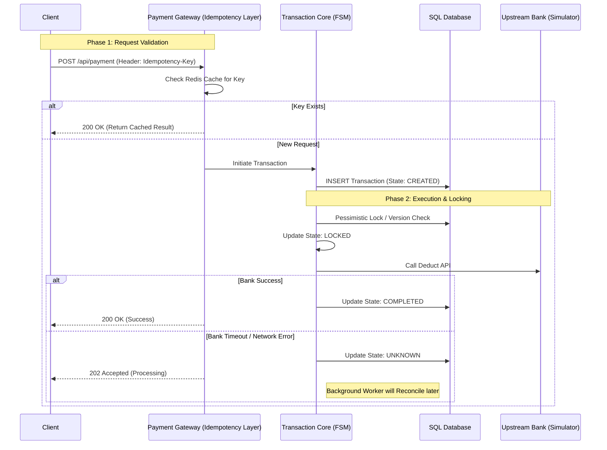

# TWQR Transaction Core (Payment Gateway)

[](https://github.com/Larry-kang/TWQR-Transaction-Core)
[](https://dotnet.microsoft.com/)
[](https://www.docker.com/)
[](./LICENSE)

> ⚠️ **DISCLAIMER: Educational Purpose Only**
>
> This project is a **Concept Proof (PoC)** demonstrating distributed system architecture (Idempotency, State Machine, Concurrency Control) using modern .NET technologies.
>
> * This project is **NOT** affiliated with, endorsed by, or connected to **FISC (Financial Information Service Co., Ltd.)** or **iPASS Corporation**.
> * The "TWQR" term is used solely to describe the compliance with public QR payment standards context.
> * All logic is implemented based on **general software engineering principles** and **publicly available documentation**, not proprietary source code.
> * No real money or financial transactions are processed.

---

<p align="center">
  <a href="#english-description">🇺🇸 English Description</a> | <a href="#chinese-description">🇹🇼 繁體中文介紹</a>
</p>

---

<h2 id="english-description">🇺🇸 English Description</h2>

> **High-Reliability Payment Simulation Engine adhering to TWQR (Taiwan QR Code) Standards.**
>
> This project serves as a reference implementation for a **Fault-Tolerant Payment Gateway**, demonstrating how to handle **Idempotency**, **Concurrency**, and **Distributed Transactions** in a high-throughput financial system.

### 🏗 System Architecture

The system is designed with **Eventual Consistency** and **Fail-Safe** mechanisms in mind. Below is the simplified transaction flow dealing with potential "Double-Spending" and upstream timeouts.



### 💡 Key Engineering Challenges Solved

1. **Idempotency (Double-Spending Prevention)**
* Implemented an **Idempotency Middleware** using Redis.
* Ensures that network retries do not result in duplicate charges, maintaining strict financial accuracy.


2. **Finite State Machine (FSM)**
* Enforced a strict transaction lifecycle: `CREATED` -> `LOCKED` -> `DEDUCTING` -> `COMPLETED` / `FAILED`.
* Prevents illegal state transitions (e.g., a `FAILED` transaction cannot unexpectedly become `COMPLETED`).


3. **Concurrency Control**
* Utilized **Optimistic Locking (RowVersion)** to handle high-concurrency scenarios.
* Prevents Race Conditions where multiple requests attempt to modify the same wallet balance simultaneously.


### 🛠 Tech Stack

* **Core Framework:** .NET 8 (ASP.NET Core Web API)
* **Database:** Entity Framework Core (SQL Server / PostgreSQL)
* **Caching & Locking:** Redis
* **Architecture:** Clean Architecture (Domain, Application, Infrastructure, API)
* **Testing:** xUnit, Moq
* **DevOps:** Docker, Docker Compose

### 🚀 Getting Started

```bash
# Clone the repository
git clone [https://github.com/Larry-kang/TWQR-Transaction-Core.git](https://github.com/Larry-kang/TWQR-Transaction-Core.git)

# Run with Docker
docker-compose up --build

```

Access Swagger UI at: `http://localhost:5000/swagger`

---

<h2 id="chinese-description">🇹🇼 繁體中文介紹</h2>

> **符合 TWQR 標準的高可靠性支付核心模擬**
> 本專案展示了在分散式金融系統中，如何透過 **.NET 8** 實作 **冪等性 (Idempotency)**、**狀態機 (Finite State Machine)** 與 **高併發控制**，解決真實支付場景中的工程難題。

### 核心解決問題 (Key Solutions)

#### 1. 防止重複扣款 (Idempotency & Double Spending Prevention)

在行動網路不穩定的環境下，客戶端重試 (Retry) 是常態。本系統實作了 **Idempotency Key** 機制：

* **機制**：API 層透過 Redis 檢查請求的唯一鍵值 (Unique Key)。
* **效果**：若偵測到重複請求，直接回傳上次的執行結果，而非重新執行扣款，確保 **資金絕對安全**。

#### 2. 交易狀態機設計 (Transaction State Machine)

摒棄脆弱的 `if-else` 狀態判斷，改用嚴格的狀態機模式管理交易生命週期：

* **流程**：`Created (建立)` -> `Locked (圈存)` -> `Deducting (扣款中)` -> `Completed (完成)`。
* **優勢**：杜絕狀態非法跳躍（例如：失敗的訂單不可直接跳轉為成功），確保帳務邏輯的嚴謹性。

#### 3. 高併發與資產一致性 (Concurrency & Consistency)

針對秒殺或高流量場景，實作 **樂觀鎖 (Optimistic Locking / RowVersion)**：

* **解決痛點**：防止 **Race Condition (競爭條件)** 導致的餘額超扣 (Over-deduction)。
* **策略**：資料庫層級的版本控制，確保同一時間只有一個請求能修改餘額。

#### 4. 最終一致性與對帳 (Eventual Consistency & Reconciliation)

針對上游銀行 (Upstream Bank) 回應超時 (Timeout) 的情況：

* **設計**：採用 **非同步補單機制**。
* **實作**：系統會先回傳 `202 Accepted`，並透過後台排程 (Background Worker) 定期向銀行端查詢最終狀態，透過 **沖正 (Reversal)** 或 **補單** 來達成帳務的最終一致性。

### 📂 專案結構 (Clean Architecture)

本專案採用 **洋蔥架構 (Clean Architecture)** 進行分層設計，確保業務邏輯的獨立性與可測試性：

```
src/
├── TWQR.Domain/          # 核心業務邏輯、實體 (Entities)、狀態機 (無外部依賴)
├── TWQR.Application/     # 應用層、Use Cases、DTOs
├── TWQR.Infrastructure/  # 基礎設施、資料庫實作 (EF Core)、Redis、外部 API 串接
└── TWQR.WebAPI/          # API 入口、Middleware (冪等性檢核)

```

---

## 👤 Author

**Larry Kang**

* **Role:** Senior Backend Engineer | FinTech Specialist
* **Focus:** Distributed Systems, Payment Architecture, .NET Performance Tuning.
* **Contact:** [LinkedIn Profile](www.linkedin.com/in/larry-kang)
