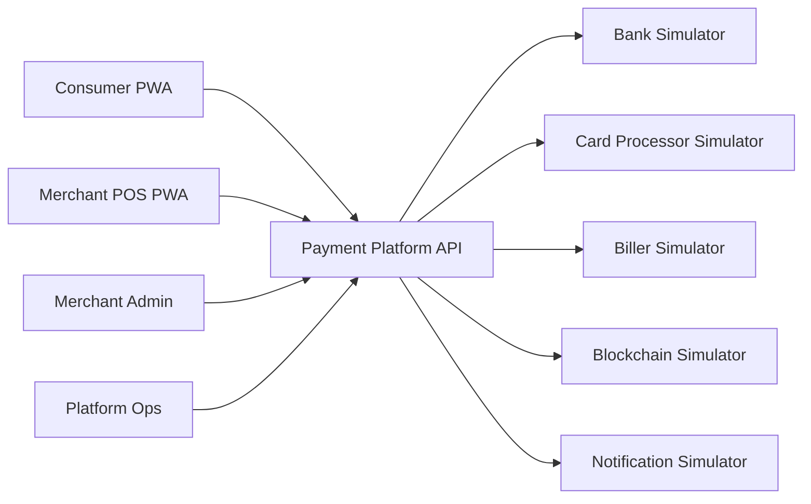

# 01. Product Scope & System Context

## 1. Product Definition

TWQR-Transaction-Core 將演進為一套 **Payment Platform Reference System**。

系統定位不是正式金融服務，也不接觸真實資金，而是用於展示支付平台後端的核心工程能力。

## 2. Primary Actors

| Actor | Responsibility |
|---|---|
| Consumer | 儲值、付款、查交易、點數、生活繳費 |
| Merchant POS | 收款、主掃/被掃、退款、查交易 |
| Merchant Admin | 交易查詢、退款、清結算、門市/終端管理 |
| Platform Operator | Payment Ops、Reconciliation、Settlement Failure、Audit |
| External Provider | Bank、Card Processor、Blockchain、Biller、Notification |

## 3. System Boundary

### In Scope

- Consumer Account / Wallet
- Merchant / Store / Terminal
- Payment Order / Payment Attempt
- Wallet Payment
- Card Payment Simulator
- QR Merchant-Presented Mode（Consumer 主掃）
- QR Consumer-Presented Mode（Merchant 被掃）
- Refund
- Double-entry Ledger
- Merchant Clearing / Settlement
- Bank Top-up Simulator
- Loyalty / Points
- Bill Payment Simulator
- Idempotency / Concurrency
- Async Event Processing
- Outbox / Inbox / Retry
- Reconciliation
- Structured Logging / Audit / Metrics

### V1.5

- Crypto Deposit Simulator
- FX Quote Simulation
- Wallet Credit after Blockchain Confirmation

### Future / Out of Scope

- 真實信用卡 PAN / CVV
- 真實銀行清算
- 真實 Blockchain Custody
- 信用卡授信 / 帳單 / 循環利息
- 真實 TWQR proprietary protocol implementation
- 真實 KYC / AML Decision Engine
- Production HSM / PCI certification

## 4. System Context

## 5. Architectural Direction

V1 採：

- ASP.NET Core
- Modular Monolith
- SQL Server
- Redis
- RabbitMQ
- Outbox Pattern
- Background Workers
- Next.js / TypeScript PWA

目的不是追求最大規模，而是清楚展示：

- Transaction Boundary
- Domain Boundary
- Money Correctness
- Failure Recovery
- Async Integration
- Operational Observability

## 6. Product Success Criteria

V1 至少可完整 Demo：

1. Consumer Wallet Top-up
2. Merchant QR 主掃付款
3. Merchant 被掃付款
4. Wallet Payment
5. Card Payment Simulator
6. Payment Timeout → Unknown → Reconciliation
7. Refund
8. Merchant Settlement
9. Points Earn
10. Bill Payment
