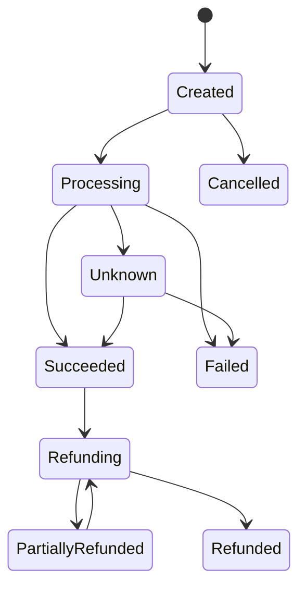

# 03. Payment Domain

## 1. Aggregate Model

Payment must not be represented by a single mutable `Transaction` entity.

Primary concepts:

### PaymentOrder

Represents the business intent:

> Merchant wants to collect a specific amount for a specific order.

Suggested fields:

```text
PaymentId
MerchantId
MerchantOrderId
Amount
Currency
PaymentMethod
Status
CreatedAt
UpdatedAt
Version
```

### PaymentAttempt

Represents one execution attempt against one payment rail/provider.

```text
AttemptId
PaymentId
Provider
ProviderTransactionId
Status
StartedAt
CompletedAt
FailureCode
FailureMessage
```

A PaymentOrder may have one or more attempts.

## 2. Payment State Machine

Initial V1 states:

```text
Created
Processing
Unknown
Succeeded
Failed
Cancelled
Refunding
PartiallyRefunded
Refunded
```

Allowed high-level transitions:



Rules:

- Status setter must not be publicly mutable.
- Transition must occur through domain methods.
- Invalid transition must return domain error/result.
- Unknown is a first-class state.
- Succeeded must not be changed to Failed directly.
- Failed must not be changed to Succeeded directly.

## 3. Payment Methods

V1:

- Wallet
- CardToken

V1.5 / Future:

- Bank account
- Points
- Composite / split tender

Processing abstraction:

```text
IPaymentMethodProcessor
├─ WalletPaymentProcessor
└─ CardPaymentProcessor
```

## 4. Core Use Cases

### UC-001 Wallet Payment

1. Validate merchant / amount / request
2. Resolve idempotency
3. Create PaymentOrder
4. Debit wallet through ledger-safe flow
5. Mark payment succeeded
6. Create merchant receivable
7. Emit PaymentSucceeded

### UC-002 Merchant QR Payment

Consumer scans merchant QR:

```text
POS → Generate QR
Consumer → Scan
Consumer → Confirm
Payment API → Process
```

QR minimum payload:

```text
MerchantId
TerminalId
MerchantOrderId
Amount
Currency
Nonce
ExpiresAt
Signature
```

### UC-003 Consumer Payment Code

Consumer presents one-time payment token:

```text
Consumer → Generate One-Time Token
POS → Scan
Payment API → Resolve Token
Payment API → Process
```

Token requirements:

- One-time use
- TTL
- Nonce
- Replay protection
- Must not expose raw account identity

### UC-004 Card Payment

Card input uses test token only:

```text
tok_success
tok_declined
tok_timeout
tok_slow
tok_unknown
```

No PAN / CVV storage.

## 5. Refund

Refund is a new business operation, not a status overwrite.

Model:

```text
RefundOrder
RefundAttempt
RefundStatus
```

Support:

- Full refund
- Partial refund
- Multiple partial refunds up to original captured amount
- Idempotent refund request

## 6. Payment API Direction

Exact contract will be defined after domain finalization.

Expected endpoints:

```http
POST /api/payments
GET  /api/payments/{paymentId}
POST /api/payments/{paymentId}/refunds
POST /api/qr/merchant-presented
POST /api/qr/consumer-presented
```

State-changing endpoints require an idempotency key.
